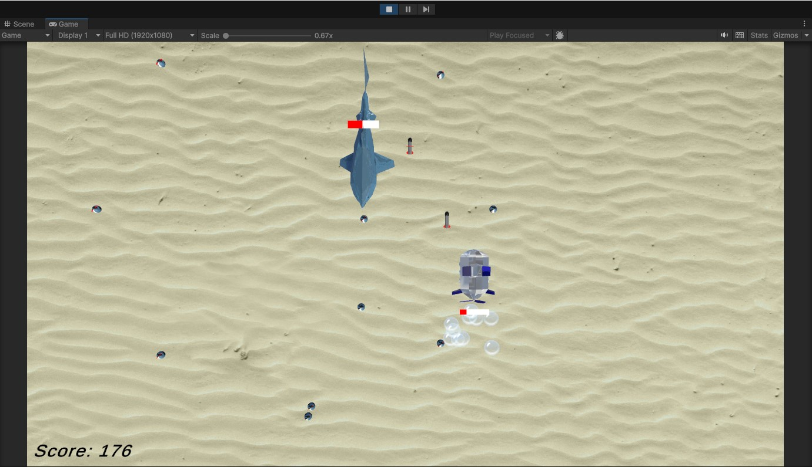

# Developer's Log - Tyrian-Like Game
### by Kateřina Čepelková
---
## Milestone 1
**Date:** 05. 10. 2024

**Work Done:**
- Ship created
  - 3D model
  - Movement (WSAD, arrow keys)
- Meteors
    - 3D model 
    - Spawner
- Shooting mechanics
    - Projectile model
    - Spawner

  
**Assets created:** 
- Materials
    - DarkGrey.mat
    - DarkPink.mat
    - DarkPurple.mat
    - ProjectileColor.mat
    - Purple.mat
-Prefabs
    - Meteor.prefab
    - Projectile.prefab
- Scenes
    - BaseGame
- Scripts
    - EnvironmentProps.cs
    - MainGun.cs
    - MeteorController.cs
    - MeteorsFactory.cs
    - ProjectileController.cs
    - ShipController.cs

**Hours Worked:** 
- Total hours: 
    - 2h - in school learning
    - 1:30h - coding + learning
    - 1h - creating ship model

**Screenshot:**

---

## Milestone 2
**Date:** 15. 10. 2024

**Work Done:**
- Introduced collisions between player projectiles and meteors
- Enemies
  - 3D model
  - Movement
  - Projectiles + Shooting in straight line automatically
  - Spawner
- Game Manager
  - 3 different levels
  - Transfering between levels using N button
  
**Assets created:** 
- Materials
    - EnemyColor-1.mat
    - EnemyProjectileColor.mat
-Prefabs
    - EnemyProjectile.prefab
    - EnemyShip.prefab
    - Game Manager.prefab
- Scenes
    - Game Manager.unity
    - Level_1.unity
    - Level_2.unity
    - Level_3.unity
- Scripts
    - EnemyFactory.cs
    - EnemyProjectieController.cs
    - EnemyShiControler.cs
    - GameManager.cs

**Hours Worked:** 
- Total hours: 
    - 2h - in school learning
    - 5h - coding + learning (most spend stuck on collisions because of missunderstud tutorial + Game Manager for some reason forgot all list and that caused the game to break)

**Screenshot:**

---

## Milestone 3
**Date:** 08.11.2024

**Work Done:**
- **Collision Handling & Damage System**
  - Implemented collision logic between player and alien ships, alien projectiles, meteors, and player projectiles.
  - Created an `Actor` class as a base class for all actors (ships, meteors, projectiles).
  - Created multiple types of enemies (3).
  - Implemented turning off the game after player death.

- **Health Management & Display**
  - Implemented health bar for each actor - meteors + projectiles have it invissible to keep the health logic consitent.

- **Cheats System**
  - Developed `Cheats` class to manage game cheats.
  - Added an “Immortality” cheat toggled with the ‘I’ key, preventing health loss on collisions when active.

- **Score and Credits System**
  - Created `Currencies` class to manage `score` and `credits` values.
  - Implemented `OnCollisionCurrencies` method to update score and credits based on collision type:
    - **Crash** (Player ship collides with alien ship): score +(healthTaken)*1, credits +(healthTaken)*1.
    - **Hit** (Player projectile hits alien ship but doesn’t destroy it): score +(healthTaken)*5, credits +(healthTaken)*1.
    - **Kill** (Player projectile destroys alien ship): score +10, credits +2.

**MAIN Assets Updated:**
- **Scripts**
  - Actor.cs
  - Cheats.cs
  - Currencies.cs
  - EnemyType.cs
  - HealthBar.cs + health bar canvas
  - (more in GitHub)

**Hours Worked:**
- Total hours:
  - 2h - school
  - 4h - collision handling + player death + multiple types of enemies
  - 2h - health bar and health system
  - 2h - cheats system
  - 2h - score and credits logic
It took a bit more  time than expected, but I managed to rework the repo into better state.

**Screenshot:**

---

## Milestone 4
**Date:** 09.11.2024

**Work Done:**
- **Asset Replacement & Visual Consistency**
  - Replaced graphical placeholders with new, visually consistent (low poly sea style) assets for:
    - **Player*: Submarine asset from [cgtrader](https://www.cgtrader.com/free-3d-models/vehicle/other/low-poly-cartoon-submarine)
    - **Enemy **: StingRay asset from [cgtrader](https://www.cgtrader.com/free-3d-models/animals/fish/stingray-fish-low-poly-3d-model)
    - **Meteor + future Boss**: Piranha and Shark assets from [itch.io](https://clownsparade.itch.io/fishbundle-lowpoly)
    - **Player Projectile**: Created simple lightning model in blender
    - **Enemy Projectile**: Created a basic rocket model in blender.
  - Added sea floor: Sand texture from https://www.alldesigncreative.com/3d-textures/sand-texture/

- **Custom Particle Effects**
  - Designed and added particle effects:
    - **Thruster Effect**: Added a bubble trail to the player’s vessel using texture https://www.pngwing.com/en/free-png-bbqho/download .
    - **Enemy Projectile lightning trail**: Created a basic lightning effect for enemy projectile with texture from https://pngtree.com/freepng/hand-painted-yellow-cartoon-lightning_3469215.html .

**MAIN Assets Updated:**
- **Models**
  - lightning.fbx *(created by me)*
  - rocket.fbx *(created by me)*
  - piranha.fbx *(https://clownsparade.itch.io/fishbundle-lowpoly)*
  - shork.fbx *(https://clownsparade.itch.io/fishbundle-lowpoly)*
  - stingray.fbx *(https://www.cgtrader.com/free-3d-models/animals/fish/stingray-fish-low-poly-3d-model)*
  - Submarine.fbx *(https://www.cgtrader.com/free-3d-models/vehicle/other/low-poly-cartoon-submarine)*
- **Textures**
  - bubble.png *(https://www.pngwing.com/en/free-png-bbqho/download)*
  - lightning_texture.png *(https://pngtree.com/freepng/hand-painted-yellow-cartoon-lightning_3469215.html)*
  - piranha.png *(https://clownsparade.itch.io/fishbundle-lowpoly)*
  - sand-texture.png + sea-floor.png *(https://www.alldesigncreative.com/3d-textures/sand-texture/)*
  - shork.png *(https://clownsparade.itch.io/fishbundle-lowpoly)*

**Hours Worked:**
- Total hours:
  - 1,5h - creating and texturing custom 3D models + researching others online
  - 2h - importing models + textures
  - 1,5h - creating and fine-tuning particle effects

**Screenshot:**

---  

## Milestone 5  
**Date:** 15. 11. 2024  

**Work Done:**  
- **Main Menu UI**  
- **Level Selector UI** 
- **Credits UI** 
- **Upgrades Shop UI** 
- **HUD & In-Game UI**  
  - Implemented in-game score counter  
  - Created health bar for the player’s ship  
  - **You died UI**
  - **You win UI**
  - **Level Completed UI**

- **Sound Implementation**  
  - Added sound effects for:  
    - Projectiles shooting
    - Explosions/Death of enemy + meteor
    - Background music  
    - UI interactions (button presses)  

**Main assets implemented:**  
- **Sounds**
  - MouseClick Effect by https://pixabay.com/users/soundreality-31074404/
  - UnderwaterShooting Effect by https://pixabay.com/users/8doxo-45097862/
  - Splash/Explosion Effect by https://pixabay.com/users/freesound_community-46691455/
  - Background Music by https://pixabay.com/users/qwertymeeto-44320025/

**Hours Worked:**  
- Total hours:  
  - 2h - UI setup + button functionality  
  - 1h - sound integration  
  - 1h - ensuring UI resizing works  

**Screenshot:**  
  

---

## Milestone 6
**Date:** 16. 11. 2024

**Work Done:**
- Levels
  - Made levels finite
  - Added level completion logic:
    - Ends after destroying a specific number of enemies/meteors
    - Ends if the player dies before reaching the count
- Boss Fight
  - Created boss enemy (Shark) with seek behaviour
  - Added boss behaviors using state machine and steering AI:
    - **Long-range attack**
      - Fires until long-range gun overheats, while backing away from player
    - **Short-range attack**
      - Activates when the long-range gun cools down, biting player (does not get hurt from collision with player object)
    - **Power-shot attack**
      - Fires multiple projectiles in all directions
      - Immediately goes into cooldown - activates immediately after

**Hours Worked:**
- Total hours: 
  - 2h - scripting and debugging boss behaviors
  - 1h - designing level-ending logic and UI

**Screenshot:**

---

## Milestone 7
**Date:** 16. 11. 2024

**Work Done:**
- **Intro Animation**
  - Added an intro animation for the player’s ship at the beginning of the level - ship will wobble into the scene.

- **Enemy Movement**
  - Added different types of movement for each type of enemy.
    - Weak - only going left + right
    - Medium - going left + right + down
    - Strong - going from top to down while looking at player

- **Options Menu**
  - Added options menu with cheats and upgrades.

- **Shop**
  - After finishing level player can choose from 3 upgrades (Movement speed + Faster Fire Rate + More Durability)
  - ***Level select shop***
    - Added an option to claim free upgrades before choosing level to play.

- **Game Balancing & Polish + Testing**
  - **Gameplay Tuning**: Adjusted various game parameters to ensure a balanced experience.

- **PC & Mobile Build**
  - **Android accessibility**: Added option to play on android, along with automatic shooting and joystick (which disappears on PC).
  - Created and tested builds for both PC and Android platforms.
  - Ensured that the UI and gameplay work smoothly on both platforms.

**Main Assets Updated/Added:**
  - Added assets for mobile version - Joystick Asset.
  - Shop with upgrades (at the start of the game and after finishing levels)

**Hours Worked:**
- Total hours:
  - 0.5h - intro animation
  - 1h - adding shop + upgrades
  - 1.5h - gameplay balance and difficulty adjustments + game testing and optimization
  - 1h - mobile build adjustments
  
**Screenshot:**

---